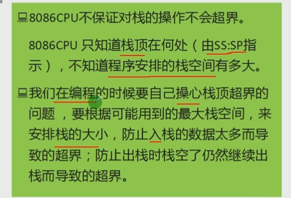

#### 汇编语言程序

[...]  (汇编语言语法规定)表示一个内存单元

(...)  （为学习方便做出的约定）表示一个内存单元或寄存器的内容

ax中的内容为0010Hp       (ax)=0010H

2000:1000处的内容为0010     (21000H)=00010H   注意21000H为物理地址

只能用寄存器及物理地址

符号 idata 表示常量

在程序中，

mov al,[0]   同 mov al,0

需要加入段前缀

mov al,ds:[0]    同 (al) = ((ds)*16+0)

#### 内存寻址方式

8086cpc寄存器

通用寄存器：ax，bx，cx，dx

变址寄存器：si，di

指针寄存器：sp，bp  （不能分成两个8位寄存器来使用）

指令指针寄存器：ip

段寄存器：cs，ss，ds，es

标志寄存器：psw

si：源变址寄存器

di：目标变址寄存器

[bx+si]  bx:基址   si：变址

[bx+si+idata]

idata是直接一个数

mov ax,[bx+si+idata]

数学化描述：(ax)=((ds)*16+(bx)+(si)+idata)     ds：段地址

#### 访问寄存器和内存jmp指令

两种用法

jmp 段地址：偏移地址（同时修改cs，ip的内容）

​	jmp 2ae3:3	

jmp 某一合法寄存器（仅修改ip的内容）

​	jmp ax(可以看成是 mov ip,ax)

ds与[address]配合

ds  段寄存器

用DS寄存器存放要访问的数据的段地址

偏移地址用[...]形式直接给出

mov bx,1000H

mov ds,bx

mov al,[0]  (认为段地址在ds里，将1000:0中的数据读到al中)

数据段在哪有ds决定

程序段有cs决定

执行哪条命令由ip起作用

 

栈段寄存器ss    -存放栈顶的段地址

栈顶指针寄存器sp   -存放栈顶的偏移地址

-- 任何时刻，ss:sp指向栈顶元素

push ax

1.sp=sp-1;

2.将ax中的内容送入ss:sp指向的内存单元，ss:sp 此时指向新栈顶

pop ax

1.将ss:sp 指向的内存单元处的数据送入ax中

2.sp=sp+2，ss:sp 指向当前栈顶下面的单元，以当前栈顶下面的单元为新的栈顶

 

